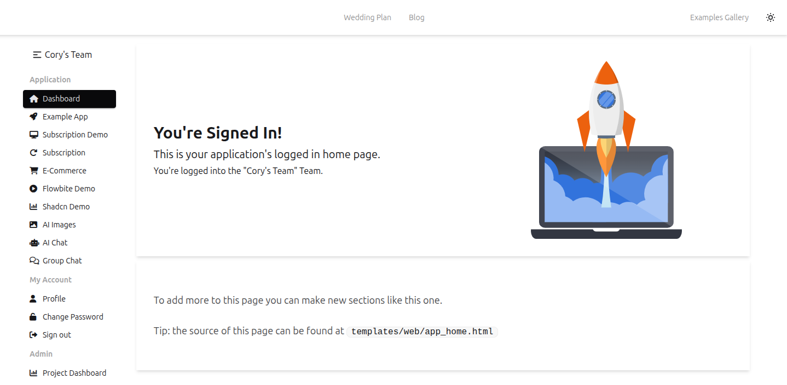
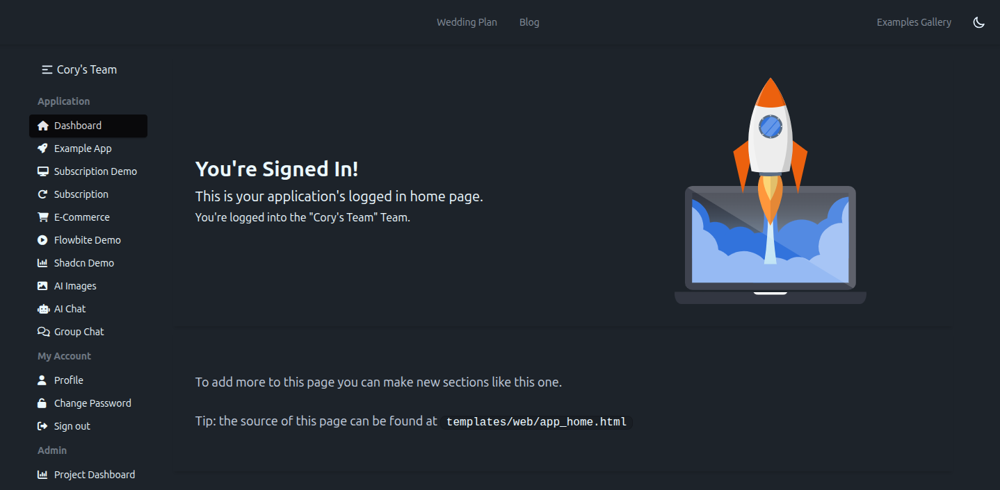
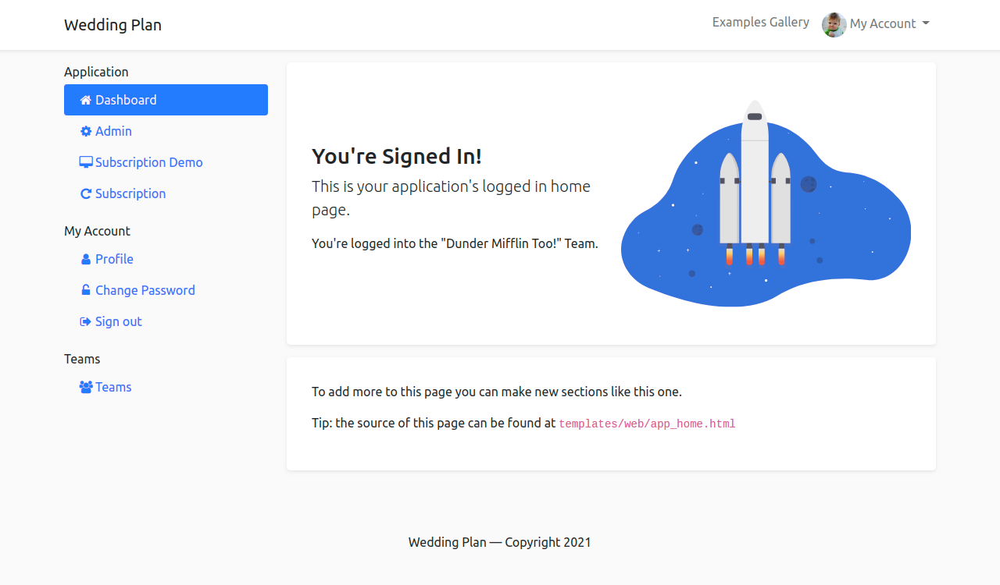
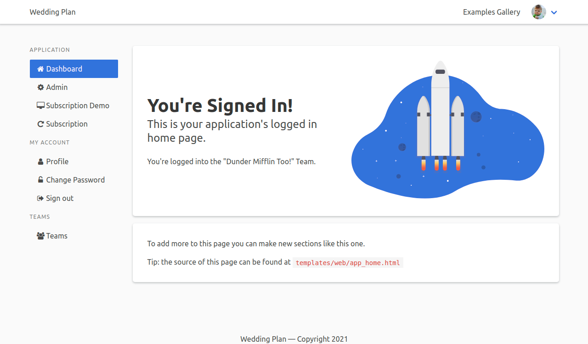
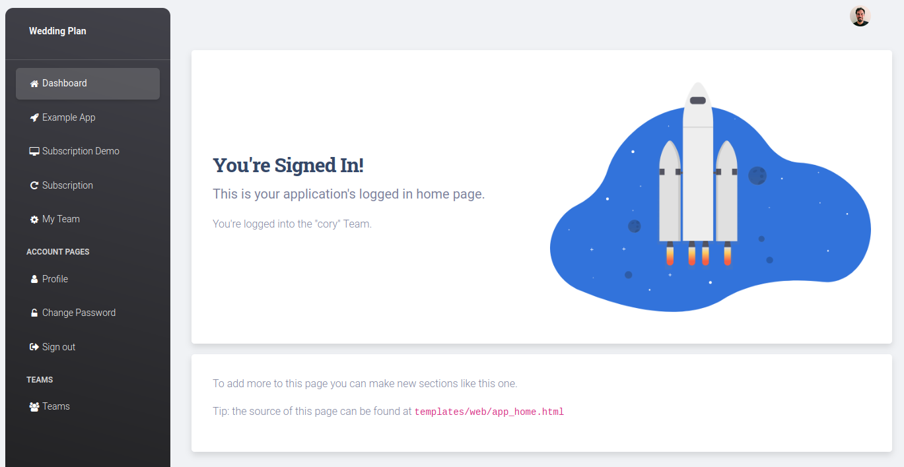

### Tailwind CSS
**Tailwind CSS is the recommended and actively supported CSS framework.**
It is the most popular choice, easiest to customize, and supports themes and dark mode out-of-the-box.

Here's what it looks like.

**Light mode**:

**Dark mode**:

### Deprecated Themes

Previous versions of Pegasus included support for a [Bootstrap 5](https://getbootstrap.com/) theme,
a [Bulma](https://bulma.io/) theme, and a theme based on Creative Tim's [Material Kit](https://www.creative-tim.com/product/material-kit)
and [Material Dashboard](https://www.creative-tim.com/product/material-dashboard) products.
_**These alternate themes have all been deprecated and are no longer recommended for new projects.**_

**Bootstrap Default Theme (Deprecated):**

**Bulma (Deprecated):**

**Bootstrap Material Theme (Deprecated):**

