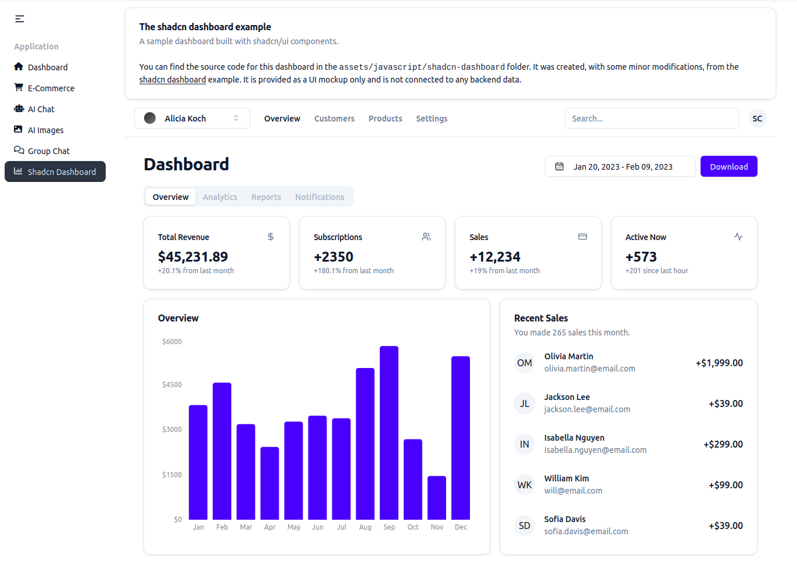

# Tailwind CSS

Pegasus supports [Tailwind CSS](https://tailwindcss.com/) (Version 4) and it is the recommended CSS framework for most projects.

## Demo and Overview

Here's a quick overview of using TailwindCSS in Pegasus

<div style="position: relative; padding-bottom: 56.25%; height: 0; overflow: hidden; max-width: 100%; height: auto; margin-bottom: 1em;">
    <iframe src="https://www.youtube.com/embed/vPtxNWx21bw" frameborder="0" allowfullscreen style="position: absolute; top: 0; left: 0; width: 100%; height: 100%;"></iframe>
</div>

## Development

Because TailwindCSS only includes the styles found in your HTML / JavaScript files, you will need to actively rebuild
your CSS files any time you add new styles/components to your templates.
The easiest way to do this is by running (after installing Node packages):

```
npm run dev-watch
```

Or in Docker:

```
make npm-watch
```

See the [front-end docs](/front-end) for more information about working with these files.

## Customization

Pegasus uses [daisyUI](https://daisyui.com/) to provide default, well-styled components with convenient CSS classes.
Components from daisyUI can be brought in as needed by your app.
A full list of available components can be found at the [daisyUI component library](https://daisyui.com/components/). 


### Changing your themes

If you enable dark mode, Pegasus will ship with the default DaisyUI light and dark themes which
are used for regular and dark mode, respectively.
But DaisyUI offers a number of [out-of-the-box themes](https://daisyui.com/docs/themes/) you can use in your Pegasus app.
To change themes, make sure the theme is enabled in the daisyui section of `site-tailwind.css` and specify
what you want for defaults for light and dark mode as follows:

```css
@plugin "daisyui" {
  themes: cupcake --default, night --prefersdark;
};
```
Additionally, you should update the `darkMode` setting in your `tailwind.config.js`:
```javascript
module.exports = {
  // sets the "night" theme as the one used for dark mode
  darkMode: ["class", '[data-theme="night"]'],
}
```

After changing these values you will have to [rebuild your front end](/front-end/overview.md).

Finally, you will also have to update the default themes in your `settings.py`:

```
LIGHT_THEME = "cupcake"
DARK_THEME = "night"
```

After this, your app should be fully styled in the new themes!

For a list of the available themes, and information about creating your on theme,
see the [daisyUI theme documentation](https://daisyui.com/docs/themes/) and their online [theme generator](https://daisyui.com/theme-generator/).

### Extending themes

If you'd like to extend one of the built-in themes you can do that in your `site-tailwind.css` file
as specified in the [DaisyUI docs](https://daisyui.com/docs/themes/#-3).

For example, to change the colors of the default theme, add a section like this:

```css
@plugin "daisyui/theme" {
  name: "light";
  default: true;
  --color-primary: blue;
  --color-secondary: teal;
}
```

## Other products / themes

### shadcn

[shadcn/ui](https://ui.shadcn.com/) is a React component library for Tailwind.
It includes many out-of-the-box components that you can install and use in your projects.

As of version 2024.11 Pegasus ships with a demo dashboard using shadcn.
To enable the dashboard you have to build with the Tailwind CSS framework and check the "Use Shadcn"
checkbox in your project settings.

Here's a screenshot:



The dashboard is [a hybrid single-page React app](https://www.saaspegasus.com/guides/modern-javascript-for-django-developers/integrating-django-react/)
served by Django.
It uses the same colors as the DaisyUI theme, and will update when you change your theme,
and has many interactive components.
However it is *not* connected to any backend data---it is just a UI example.

#### Working with shadcn

The dashboard can be found in `assets/javascript/shadcn-dashboard`.
Shadcn components are stored in the `assets/javascript/shadcn/components/ui` folder.

Components can be imported in other JavaScript files using the same import path syntax used by the dashboard:

```javascript
import { Button } from "@/components/ui/button"
```

You can use the [shadcn cli](https://ui.shadcn.com/docs/cli) to create components,
and they should automatically be added to the right folder.

### Flowbite

[Flowbite](https://flowbite.com/) is a library with many great UI components---most of which are free and open source.
Also, unlike shadcn, it does *not* use React---making it a great fit for Django templates and htmx projects.

As of version 2024.11 Pegasus ships with the option to enable flowbite, along with a page demonstrating
some sample components.
To enable Flowbite, choose Tailwind CSS and check the "Use Flowbite" checkbox in your project settings.

If you enable this setting, flowbite will automatically be installed and you can drop
flowbite components into any Django template.
The reference page has an example of a few of these components.

#### Extending Flowbite

The default setup shows how to use Flowbite *alongside* DaisyUI.
However, if you want to use Flowbite more holistically for your application you can.

To get started, uncomment the following line in your `site-tailwind.css` file:

```
/* @import "flowbite/src/themes/default"; */
```

This will add flowbite's default styles, which are necessary for some extended components like datatables.

### Tailwind UI

[Tailwind UI](https://tailwindui.com/) is a great product for building more complex pages, including marketing sites and app UIs.
It another great option for getting help with UI components and pages, and should integrate seamlessly with the current Pegasus templates.

Note that you will have to rebuild styles when adding TailwindUI components, as described in the "Development" section above.

## Upgrading from Tailwind 3 to 4

Pegasus 2025.3 updates Tailwind from version 3 to version 4. This is a big upgrade, and if you have added Tailwind markup to your
project you will likely need to upgrade your own code and not just rely on the Pegasus updates.

This section should help you with that process.
It will be updated over time as additional questions and issues come up.
If you have any problems with the migration, send a message in the community Slack!

It's recommended to follow the following steps to upgrade your project to Tailwind 4:

1. Read through the [Tailwind Upgrade Notes](https://tailwindcss.com/docs/upgrade-guide) and confirm you're ready to
   upgrade from a browser support perspective.
2. Do a [normal Pegasus upgrade](/upgrading.md) of your project to Version 2025.3 or later.
2. Merge all conflicts as carefully as you can.
3. Rebuild your front end (`npm install`, `npm run dev`).
4. Run your app.

At this point, your project should be running on Tailwind 4,
though you should review the sections below for additional steps.

### Restoring custom themes

To restore custom themes, follow the [instructions above](#changing-your-themes) to re-apply your theme configuration
(and if necessary, be sure to also remove it from `tailwind.config.js`).

Note that some DaisyUI themes look slightly different in version 5 and may require further customization for the same
look-and-feel.

### Migrating non-Pegasus files

You will likely want to run the [Tailwind upgrade tool](https://tailwindcss.com/docs/upgrade-guide#using-the-upgrade-tool)
on your project to apply any automatic upgrades to files that aren't managed by Pegasus.

After going through the steps above, you can re-run Tailwind's migration tool by following these steps.

First, temporarily re-install Tailwind v3 on your project. This is required for the upgrade tool to run:

```bash
npm install tailwindcss@3
```

Next, temporarily restore the "content" section in your `tailwind.config.js` from your main branch.
It should look something like this:

```javascript
  content: [
    './apps/**/*.html',
    './apps/web/templatetags/form_tags.py',
    './assets/**/*.{js,ts,jsx,tsx,vue}',
    './templates/**/*.html',
  ],
```

Finally run the upgrade tool:

```bash
npx @tailwindcss/upgrade --force
```

This should apply Tailwind's automatic migrations to your existing HTML / JS / CSS files.
Review these changes, commit the changes you want, and then undo the changes made to the `content` section above.
Note that you may not want to apply some changes like shadow-downsizing, since these have already been included in Pegasus.

### DaisyUI Updates

Some common DaisyUI upgrades that you may need to check include:

- Changing active navigation tab classes from `"active"` to `"menu-active"`.
- Removing `-bordered` from inputs.

## Troubleshooting

### Styles aren't working after adding new components

Every time you use a new Tailwind class you need to rebuild your front end as described in the "[Development](#development)" section above.

After doing that, if they are still not showing up, be sure that you have hard-refreshed your browser (Ctrl-Shift-R) on most browers.
You can also disable browser caching when devtools are open by following these instructions
[for Chrome](https://stackoverflow.com/a/23944114/8207) or [for Firefox](https://stackoverflow.com/a/48027947/8207).

If you are building your front end in Docker, be sure to also read the troubleshooting section of the [front end documentation](/front-end/overview.md)
for potential issues with cross-platform compatibility.
