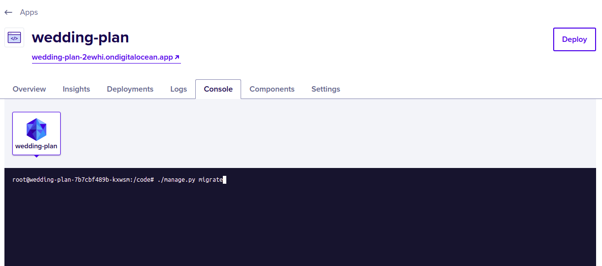

Pegasus provides native support for Digital Ocean App Platform.
To build for Digital Ocean, choose the "digital_ocean_app_platform" option when installing Pegasus.
Then follow the steps below to deploy your app.

### Prerequisites

If you haven't already, create your Digital Ocean account.
**You can sign up with [this link](https://m.do.co/c/432e3abb37f3) to get $100 credit
and help support Pegasus.**

Next, install and configure the `doctl` command line tool by following [these instructions](https://www.digitalocean.com/docs/apis-clis/doctl/how-to/install/).

Additionally, you must connect Digital Ocean to your project's Github repository.
This can be done from inside App Platform, or by following [this link](https://cloud.digitalocean.com/apps/github/install).


### Set up Databases

Before you can deploy you will need to set up databases for your application.

First, navigate to [Databases --> New](https://cloud.digitalocean.com/databases/new), and choose
"PostgreSQL" and the latest version (as of this writing, v17).

You can leave most of the settings as-is, though feel free to change as you want.
The smallest size should be fine for most applications getting stared.

For the database cluster name it's recommended to use `<your-project>-db` to match
the default value expected by Pegasus.

If you are planning to use Celery or Redis (Valkey), you'll also have to create that Database.

Repeat the process above, but choosing "Valkey" for the database type.
For your Redis database cluster name, it is recommended to use: `<your-project>-redis` to match
the default value expected by Pegasus.

### Deploying

Once you've configured the prerequisites and set up your databases, deploying is just a few steps.

First, edit the `/deploy/app-spec.yaml` file. In particular, make sure to set your Github repository and branch.
Also, if you did not use the database naming conventions above, then you will have to adjust your
database `cluster_name` values to the ones you chose for Postgres and Redis/Valkey, respectively.

If you don't need Celery, you can remove the sections related to Redis, and the workers (celery and celery-beat).
This will substantially reduce the costs of running your app (the workers are $20/mo and Redis is $15/mo).

Once you've made all the edits to the `app-spec.yaml` file you can deploy your app by run the following command:

```
doctl apps create --spec deploy/app-spec.yaml
```

That's it!
In a few minutes your app should be online.
You can [find and view it here](https://cloud.digitalocean.com/apps).

Once your app is live, you should restrict access to your Postgres and Redis/Valkey instance,
by navigating to each database in the Digital Ocean console and setting your app as a "trusted source" and saving.
Failure to do this may result in your app's data and infrastructure being exposed to the public.

**After deploying, review the [production checklist](/deployment/production-checklist) for a list
of common next steps**.

### Settings and Secrets

App platform builds use the `settings_production.py` file.
You can add settings here, and use environment variables to manage any secrets, following the pattern used
throughout the file.

Environment variables can be managed in the Digital Ocean dashboard [as described here](https://docs.digitalocean.com/products/app-platform/how-to/use-environment-variables/).

### Running One-Off Commands

The easiest way to run once-off commands in your app is to click the "console" tab in app platform and just type in the command.
See the screenshot below for what it looks like:



You may also need to run additional commands to get up and running, e.g. `./manage.py bootstrap_subscriptions`
for initializing your Stripe plan data.

### Celery Support

Celery should work out-of-the box.

If you have issues running celery, ensure that you have created a Redis database, and that the values for the
`REDIS_URL` environment variables match the name you've chosen.

If you need to run `celerybeat` (for scheduled/periodic tasks), you'll have to add a second worker to your
`app-spec.yaml` file. You can copy and paste the configuration for the `celery` worker, but replace
the `run_command` with the following line (swapping in your app name for `your_app`):

```bash
celery -A your_app beat -l INFO
```

Note that simply adding `--beat` or `-B` to the existing Celery worker does *not* work on app platform.
