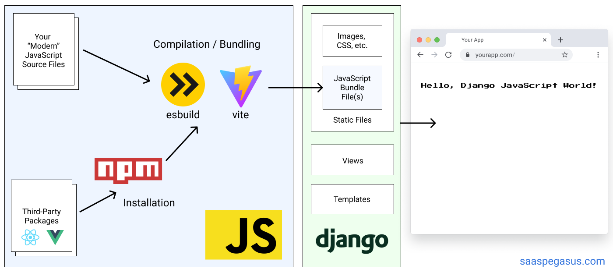

Front End Overview
==================

*This page documents the front end files that are integrated into Django.
See [the standalone front end docs](/experimental/react-front-end) for the separate React front end.*

## Architecture

Pegasus's front-end architecture is a hybrid model, with a front-end codebase
that is compiled and used directly in Django templates via Django's static files infrastructure.

There are two setups, one built on top of Webpack, and a more modern one built on top of Vite.
The architecture of these is very similar, just built on different tools.

Big picture, the front end consists of a build tool ([Vite](https://vite.dev/) or [Webpack](https://webpack.js.org/))
and a compiler ([esbuild](https://esbuild.github.io/) or [Babel](https://babeljs.io/)) which compiles the front-end code into bundle
files that can be referenced using Django's static file system, as represented in the diagram below.

**Vite**



**Webpack**


Pegasus's styles use either the [Tailwind](https://tailwindcss.com/),  [Bootstrap](https://getbootstrap.com/) or [Bulma](https://bulma.io/) CSS frameworks,
and building the CSS files is included as part of the front-end build pipeline.
For more details on CSS in Pegasus, see the [CSS documentation](/css).

**For a much more detailed overview of the rationale behind this architecture,
and the details of the set up see the [Modern JavaScript for Django Developers](https://www.saaspegasus.com/guides/modern-javascript-for-django-developers/)
series.**

## Choosing a front end build tool

Pegasus currently lets you choose between Vite and Webpack as the primary build tool for your front end.
Choosing is relatively simple: **if you don't know what you want, use Vite**.

Vite is faster, more modern, and includes a number of features not supported by webpack, including:

1. Hot Module Replacement (HMR)---a development feature that lets code changes in your front end files automatically
   update without a full-page reload.
2. Code splitting---a production feature that breaks your front end files into individual bundles that encapsulate
   code dependencies. This leads to less redundant JavaScript and faster page loads.

The main reason to choose Webpack is if you are already using it and don't want to switch tools.
See [this video](https://www.youtube.com/watch?v=qVwRygtffiw) for more on the benefits of Vite over Webpack.

## Front-end files

The source front-end files live in the `assets` directory, while the compiled files
get created in the `static` directory.

Generally you should only ever edit the front-end files in `assets` directly,
and compile them using the instructions below.

## Prerequisites to building the front end

To compile the front-end JavaScript and CSS files it's expected that you have installed:

- [Node.js](https://nodejs.org/)
- [NPM](https://docs.npmjs.com/downloading-and-installing-node-js-and-npm)

Pegasus is developed and tested on the latest LTS releases, which (at the time of this writing)
are Node version {{default_node_version}} and npm 11.
Later versions will likely work, but aren't regularly-tested.

It's recommended to use [`nvm`](https://github.com/nvm-sh/nvm) to manage different node/npm environments more easily.
`nvm` is essentially `virtualenv` for Node.js/npm.

Alternatively, you can build and run your front end with Docker.
However, this has been known to cause performance problems in some environments.

## Initial setup

Once you've installed Node and NPM, you can install your front end dependencies by running:

```bash
npm install
```

or in Docker:

```bash
make npm-install
```

In your project's root directory.
This will install all the dependencies necessary to build the front end.

It will also generate a `package-lock.json` file.
**It is recommended that you add the `package-lock.json` to source control for consistency across installations.**

## Building in Development

The development set up is slightly different between Vite and Webpack.
For details see these links:

- [Vite in Development](./vite.md#vite-in-development)
- [Webpack in Development](./webpack.md#development-with-webpack)


## Building for production

To build for production, run:

```bash
npm run build
```

or in Docker:

```bash
make npm-build
```

This will compress your files, remove logging statements, etc.
In most [supported deployment set ups](/deployment/overview), this will be run automatically for you as part of your deployment.

## TypeScript and type checking

Since the 2022.6 release, Pegasus includes TypeScript as part of the front end code.
You can write TypeScript or JavaScript code and it will be transpiled to work in a browser as part of the
build pipeline.

The build pipeline does *not* explicitly do type checking.
To do type checking you can run:

```bash
npm run type-check
```

Or in Docker:

```bash
make npm-type-check
```

Type checks will also automatically run on new pull requests if you have enabled Github Actions on your project.
