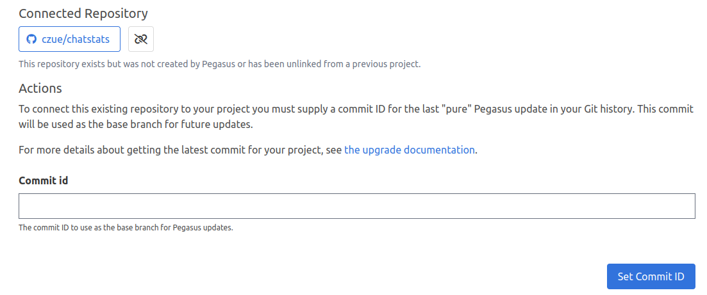

import { Steps } from '@astrojs/starlight/components';

As of February, 2024 you can connect your Pegasus projects directly to GitHub instead of downloading them as a zip file.
This makes for a more streamlined workflow---especially when changing or upgrading your project.

## Watch the video

The following video shows how to create and update a project using the Github integration.

    <iframe src="https://www.youtube.com/embed/5PLO79rb--A" frameborder="0" allowfullscreen style="position: absolute; top: 0; left: 0; width: 100%; height: 100%;"></iframe>

## Connecting your account

There are three ways to connect your Github account to Pegasus.
The **GitHub App** is the recommended approach for most users.

### Using the GitHub App (Recommended)

The GitHub App is the easiest and most secure way to connect your account.
Unlike the other methods, the GitHub App only grants Pegasus access to repositories you explicitly choose,
and it works seamlessly with both personal and organization-owned repositories.

<Steps>
1. **Create a repository.** First, [create a new private repository](https://github.com/new) on GitHub for your project.
2. **Install the app.** From your project download page, click "Install GitHub App".
   You'll be redirected to GitHub to install the app and select which repositories it can access.
   Make sure to grant access to the repository you just created.
3. **Connect your repo.** After installing the app, you'll be redirected back to Pegasus.
   Select your repository from the dropdown and click "Connect Repository".
</Steps>

Once connected, Pegasus can push code and create pull requests in your repository.

**Managing permissions:** If you need to grant access to additional repositories later,
click "Configure permissions" from the project download page.
You can also manage your installation from your [GitHub App settings](https://github.com/settings/installations).

### Using "Connect Github" (OAuth)

You can also connect your account using the "Connect Github" button on the project download page.
This is an easy way to get set up, but grants access to all private repositories in your account.
Pegasus does not view or modify data in any repositories unless you connect them, but it theoretically could.

### Using Personal Access Tokens

Pegasus can also connect to your repositories using
[Personal Access Tokens](https://docs.github.com/en/authentication/keeping-your-account-and-data-secure/managing-your-personal-access-tokens).

These work similarly to the Github app, but are less user-friendly and require more manual setup.
There is no real reason to use them now that the Github app exists, but they are still supported for legacy projects.

#### With Classic Tokens

To use Pegasus with a classic token, visit the [Personal access tokens](https://github.com/settings/tokens) page on Github,
then select "Generate new token (classic)" from the dropdown, or [visit this page](https://github.com/settings/tokens/new).

Choose a note and expiration date for your token and grant the following scopes:

- user:email (Access user email addresses (read-only))
- repo (Full control of private repositories)
- workflow (Update GitHub Action workflows)

Then click "Generate token".
You will be taken to a page where your token is displayed.
Copy this value and paste it into the "personal access token" field from your project download page on Pegasus.
Note that you won't be able to view the token again!

#### With Fine-Grained Access Tokens

If you want the most control over your permissions, you should use a fine-grained access token,
which allow you to control access to specific repositories.

Note that if you use fine-grained tokens **you must create the repository for your project before creating the token**.
Pegasus cannot create the project for you with these tokens.

After creating the repository, [create a new fine-grained-token from this page](https://github.com/settings/personal-access-tokens/new).
Set a token name and expiration date, and then use "Only select repositories" to choose the repositories you want to
grant access to (the one you just created).

Under "Permissions" --> "Account Permissions" you must grant *read* access to:

- Email addresses

Then under "Permissions" --> "Repository Permissions" you must grant **read and write** access to:

- Contents
- Pull Requests
- Workflows

Then click "Generate token".
You will be taken to a page where your token is displayed.
Copy this value and paste it into the "personal access token" field from your project download page on Pegasus.
Note that you won't be able to view the token again!

## Connecting an existing project to Github

Projects that were created before February 2024, or that didn't use the Github integration can still be
connected to Github via a one-time process.
After completing this, you will be able to upgrade and change your Pegasus project using automatic pull requests.

First, you'll have to connect your Github account using one of the methods described above.

Next, you will need to find the commit id of the last Pegasus update you have made.
If you have never updated your codebase, this will be the first commit in the repository, which you can
find by running `git log --reverse`.

If you have updated your codebase using one of the other methods below, this will be the last commit
on the `pegasus` branch of your repository, which you can find by running `git checkout pegasus` followed by `git log`.

Once you have the commit id ready, add your existing Github repository to your Pegasus project from the downloads page.
After completing this step you will be prompted with a page that looks like this:

Enter the commit ID there, and you should now be able to update your project with pull requests.

## Working with repositories owned by an organization

If you're using the **GitHub App**, organization repositories work automatically---just make sure to
install the app on the organization account (not your personal account) and grant access to the relevant repositories.

For **OAuth** and **personal access tokens**, Github organizations do not allow API-based repository access by default,
so you will also need to grant programmatic access.
Github provides detailed guidance on how to do this.
For "Connect Github," follow the [oauth instructions](https://docs.github.com/en/organizations/managing-oauth-access-to-your-organizations-data),
and for personal access tokens, follow the [personal access token instructions](https://docs.github.com/en/organizations/managing-programmatic-access-to-your-organization/setting-a-personal-access-token-policy-for-your-organization).

## Pushing Pegasus code to a subdirectory in your repository

By default, your entire git repository is dedicated to Pegasus, with all of Pegasus's files included at the root
of the repository. Some projects---especially those with a separate front end---may want to instead include Pegasus code
in a subdirectory of the repository (e.g. "backend"), so that other projects (e.g. "frontend") can be included
in the same repository.

It is possible to configure your Github integration this way.
Connect your repository first, then expand "Repo settings"
on the project download page and set the subdirectory there.

If you would like to update an existing project to use a subdirectory, you'll have unlink and re-add your repository,
then [reconnect it](#connecting-an-existing-project-to-github).

## Troubleshooting

**I keep getting "Error pushing to GitHub. Please check your token scopes." when pushing my project.**

While Pegasus does its best to catch errors that come from Github and show them to you,
sometimes it will return this generic error.

One common reason a valid token is unable to push code is related to email privacy settings.
Specifically the "Blocking command line pushes that expose your personal email address" setting---which
currently must be *disabled* in order to use the Github integration.

To check and disable this setting:

<Steps>
1. Go to your [Github email settings](https://github.com/settings/emails)
2. Scroll down to where it says "Keep my email addresses private".
3. If that option is checked, ensure that the "Block command line pushes that expose my email" option
   below it is *not* checked.
4. If that option is *not* checked, then it is a different problem. You are welcome to reach out directly for support
</Steps>

**My GitHub App can no longer access my repository.**

If you remove a repository from your GitHub App's permissions (or uninstall and reinstall the app),
Pegasus will lose access to the repository. To fix this, click "Update your app permissions" from
the error message on your project download page. This will redirect you to GitHub where you can
re-grant access to the repository.
