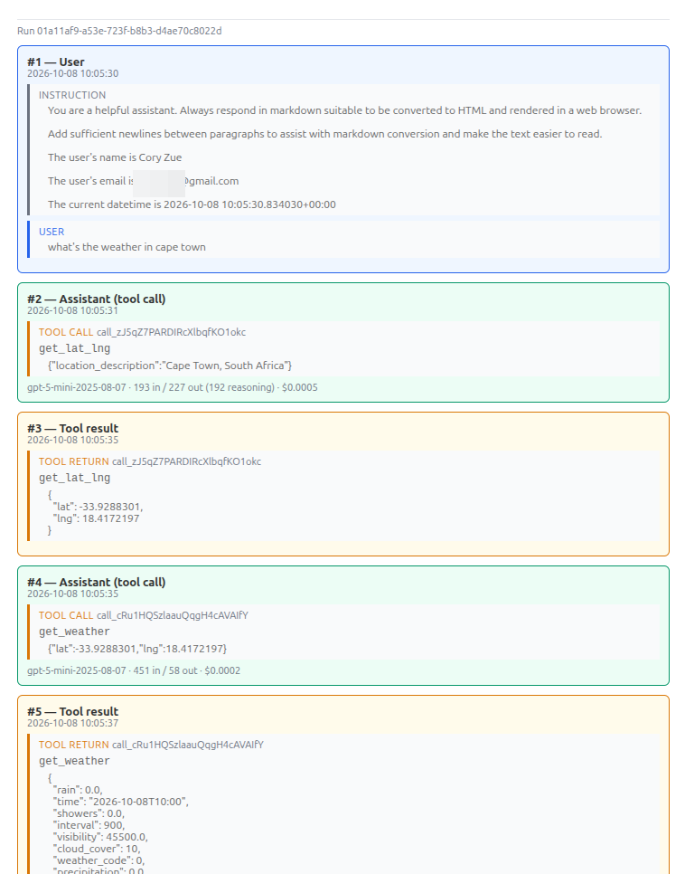

import { Aside } from '@astrojs/starlight/components';

<Aside type="caution" title="In Development">
These release notes are for a version that is still in development and has not been released yet.
Features and changes may be modified before the final release.
To try these features early, see the [Early Access Program](/early-access/).
</Aside>

*The development release notes are generated by AI and may contain errors.*

---

## Version 2026.10

This release is primarily focused on improving AI/agent chat functionality and setting it up for future improvements.
The biggest changes are:

1. Chats now keep their full tool-call history between turns.
2. Chats are now associated with teams (if building with teams).
3. Some refactors around how agents are run and surrounding functionality, to centralize functionality and
  make future changes (and customizing behavior) easier.

There are also a handful of other upgrades/fixes.

### AI Chat Improvements

- **Chats now save the full pydantic-ai message history, including tool calls.**
  A new `Chat.message_history` field stores the structured history after each agent run, so later turns
  keep the context of earlier tool calls. Also added a (admittedly, vibe-coded) admin UI to view the history
  (pictured below), so you can see exactly what happened in a conversation (including tokens and costs.

  

- **New chats are attributed to the user's current team** (on builds with teams enabled).
  `Chat` now has an optional `team` field, which is set when a chat is created.
  This is currently only for attribution and doesn't control access (chats are still private to their user).
  This is to help lay the foundation for more integrated chat and team functionality.
- Refactored agent streaming so that stream events are now mapped to UI events in a single place (a `map_stream_event()` function)
  and moved the entire streaming loop into the `ChatSession` object.
  - `run_agent` and `run_agent_streaming` are no longer needed and were removed.
- Centralized the logic for naming a chat from its first message into a single `name_chat_from_message()` helper,
  used by both the API views and `ChatSession` and bumped the threshold for naming a chat from 30 to 40 characters.
- Added a bunch of additional tests for chat functionality, and rewrote the `ChatSession` history tests to use pydantic-ai's `TestModel`.

### Other Changes

- **Upgraded Python dependencies.** Notable upgrades include Wagtail 8.0, OpenAI 3, Anthropic 1.2, pydantic-ai 2.36,
  Django REST Framework 3.18, and the Pegasus CLI 0.16.
  Django stays on 6.0.x, because `django-celery-beat` doesn't support Django 6.1 yet.
  - Added a few Wagtail 8 dependencies that have no type stubs to the mypy ignore list.
- Added a `get_default_team(user, session)` helper in `apps/teams/helpers.py`, so the current team
  can be looked up when there is no request, like in a websocket consumer.
- Updated the Turnstile setup to reject local hostnames if DEBUG is not enabled, so that a single turnstile key
  can be used for both dev and prod. Thanks Mario for suggesting!
- Raised the admin database MCP server's startup timeout to 30 seconds.
- Fixed a bug in the chat APIs on the experimental Django Ninja builds.
- Fixed a few dangling `pg-` CSS classes and redundant legacy classes in Tailwind templates when building without Pegasus CSS classes.
  Thanks Brennon for reporting!
- Fixed a test in `subscriptions/tests/test_metadata.py` that would inadvertently fail if you customized `ACTIVE_PLAN_INTERVALS`.
  Thanks Brennon for reporting!

### Upgrading

This release adds new migrations for the `Chat` model (`message_history`, and `team` on team-enabled builds).
Run `./manage.py migrate` after upgrading.
