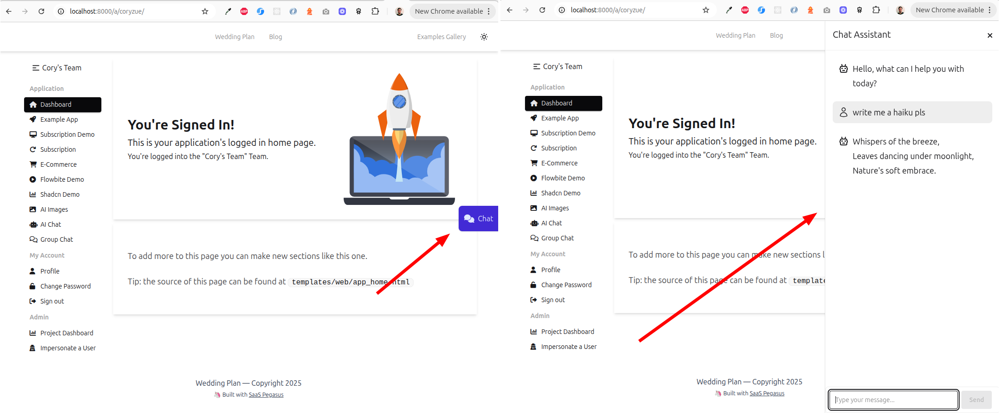

Releases of [SaaS Pegasus: The Django SaaS Boilerplate](https://www.saaspegasus.com/) are documented here.

*For older releases, see the [Release Notes History](/release-notes-history/) page.*

## Version 2025.11.2

This is a bugfix release addressing a few issues:

- **Switched the default production celery pool from `gevent` to `threads`.**
  This fixes compatibility issues between `gevent` and `asyncio` that arose when using agents inside Celery.
  Thanks Matt for reporting and suggesting the fix!
  - This change also removes `gevent` from production requirements. If you were using it elsewhere you should keep it.
- Fixed a bug where the "New Agent Chat" button didn't properly set the agent name on React / non-async builds.
- Fixed a whitespace issue in the Digital Ocean `app-spec.yaml` file that was causing an invalid config.
- Bumped the Postgres version on Digital Ocean to the latest (version 18).
- Added the `/.vite/` path back to the `.gitignore` file.

*November 27, 2025*

## Version 2025.11.1

This is a minor hotfix release fixing two issues:

- Fixed a crash in the teams example app, due to an incorrect reference to
  `model.for_team()` (instead of the correct `model.for_team`). Thanks Eugen for reporting!
- Fixed an issue where Heroku Redis URLs accidentally removed `?ssl_cert_reqs=none` if you used
  the Docker-based build. Thanks Steven for reporting!


*November 17, 2025*

## Version 2025.11

Here's what's in the November release.

### New Team scoping features

These updates provide more consistent ways to filter your models based on the current team and help avoid
writing bugs related to forgetting to apply a team filter to your DB queries.

If you're happy with the current teams setup you can largely ignore these changes—they mainly add
new, optional functionality on top of the existing system.

If you would like to introduce more strict Team filtering and checking in your app, review
the changes below and updated sections of the documentation.

Details:

- Added a new [context variable](/teams/#team-context-variable) to keep track of the current team.
- Updated the `TeamsMiddleware` to automatically set/unset the variable for the user's current team.
- Added a new `TeamScopedManager` class to automatically filter a queryset based on the current team (from the context variable).
- Updated `BaseTeamModel` to add `for_team = TeamScopedManager()`, which can be used to automatically filter a team
  moodel based on the current team.
- `TeamsMiddleware` will no longer set `request.team` to the user's default team if it is not in the URL.
  Previously it would return the most recently visited team or the first team that the user is a member of.
  If you need that behavior, you can now use `request.default_team`.
- Added several tests for the above functionality.

See [the updated teams documentation](/teams) for more information about working with these tools,
including how to use them to [always enforce that a team is set](/teams/#strict-team-access).


### Other changes

**Added**

- **Added [AGENTS.md](https://agents.md/) as an additional output format for AI rules files.**
- **You can now clone/copy projects in SaaS Pegasus**—starting a new project with an existing project's configuration
  instead of the defaults each time.  (Thanks Patrick for the suggestion!)

**Changed**

- **Upgraded all Python packages.**
- **Upgraded all JavaScript packages.**
- Updated `.vite` declaration in the `.gitignore` to make it more obvious how to check in vite's built static files if you want to do that. Thanks Lile for suggesting!
- Updated AI API key environment variables to be the defaults used by Pydantic AI so they can be set in a single place.
  You should now set `OPENAI_API_KEY` instead of `AI_CHAT_OPENAI_API_KEY`
  and `ANTHROPIC_API_KEY` instead of `AI_CHAT_ANTHROPIC_API_KEY`.
- Updated links to the Django docs to always point to the latest stable release.
- Updated Kit (formerly ConvertKit) mailing list integration to V4 of the API. Thanks Ben H for suggesting!
  - Changed `CONVERTKIT_API_KEY` setting / environment variable name to `KIT_API_KEY`.
  - Also updated [the docs](/configuration/#kit-formerly-convertkit).
- Updated `django_browser_reload` to only setup the app/middleware if `DEBUG=True`.
  This removes a warning in production. (Thanks Zac for the suggestion!)
- Made minor updates to AI rules files.

**Fixed**

- The employee agent demo now uses a proper `Enum` for departments, preventing invalid options from being used.
- Fixed an issue with using `TransactionTestCase` in certain build configurations due to an issue with `django-waffle`.
  This was done by updating a migration to remove the unexpected tables, as outlined in
  [this comment](https://github.com/django-waffle/django-waffle/issues/317#issuecomment-488398832). Thanks Ben N for reporting!
  - The migration was also renamed - see upgrade section for details.
- Fixed some places where types were set incorrectly or didn't pass type-checking.
- Fixed a bug where `django_browser_reload` was always enabled, even if you had turned it off.


### Upgrading

- If you had any code dependent on `request.team` being set even if there was no team in the URL, you should
update that code to use `request.default_team`.
- If you were using the (Convert)Kit integration, you should update based on the [latest documentation](/configuration/#kit-formerly-convertkit).
- The migration `/apps/web/migrations/0002_patch_djstripe_column.py` was renamed to `/apps/web/migrations/0002_patch_third_party_tables.py`.
  - In most cases, this should apply correctly, but if you have any issues with it,
    you can re-create the migration by running `./manage.py makemigrations web --empty`
    and then copying the contents of the file across (except for the generated `("web", "000x_xxxx"),` dependency line).
    Alternatively, if you don't use `TransactionTestCase`, you can just reject the migration file changes.

*Nov 10, 2025*

## Version 2025.10

This release improves the developer experience of working with Pegasus.
It has a number of changes that make things simpler, smoother, and more consistent.
These changes also make it easier for AI agents to work in Pegasus codebases.

Key changes:

- All projects will default to Postgres, Vite, and Tailwind moving forwards. Other options will be slowly phased out.
- All projects will ship with Docker containers for Postgres and Redis (you can ignore these if you want to run them separately)
- The `Makefile` now ships with every project and includes commands for running everything you need in development.
  These commands are also available in AI rules files for AI agents.
- `make init` will work on all projects, and is all you need to get running (after installing prerequisites)
- Added some dev quality-of-life tools.

Details below.

### Services-only Docker setup

This release adds default "services-only" Docker setup for projects that weren't using Docker already.
In this mode, Postgres and Redis run via Docker, but Python and Node/npm run natively.
*This is now the recommended way to develop Pegasus applications.*
You can read more in the updated [Docker docs](/docker).

### Expanded `make` support

The `Makefile` will now be included on all Pegasus builds.
This can be used to run the app, tests, migrations, front end, and more without having to remember
the exact commands, and can be easily customized.

You can run `make` without any arguments to see the available options.

### Added a `dev.sh` script to run Django and Vite/Webpack in a single command

For projects not already using Docker, a `dev.sh` script was added that runs both Django and Webpack/Vite
in a single command, handling process management for you.
Running `make dev` will use script, though you can also run it manually via `./scripts/dev.sh`.

This allows you to easily stop and start these two coupled processes together without having to fiddle
with multiple terminals or tools like `tmux`.

### Expanded README and Agents files

The project's README and the various Agent files (cursor rules, CLAUDE.md, etc.) have been
overhauled and expanded to use the `make` commands.
This provides a simpler on-ramp both for developers and agents to run the app and the various
supporting commands.

### Streamlined development tooling

Two new packages were added to improve the developer experience:

- [django-watchfiles](https://github.com/adamchainz/django-watchfiles) improves the Django dev server's
  autoreloading behavior in several ways, making it both faster and use less system resources.
  [Learn more here](https://adamj.eu/tech/2025/09/22/introducing-django-watchfiles/).
- [django-browser-reload](https://github.com/adamchainz/django-browser-reload) adds automatic page
  reloading to your browser whenever code changes.

Both of these options are development features, and should have no impact on applications in production.
Browser reload is enabled on all projects by default, while watchfiles is off by defualt because
of [this "file watch limit reached" issue on some filesystems](https://github.com/adamchainz/django-watchfiles/issues/135).
Both options can be enabled/disabled under advanced development settings.

Thanks to [Adam Johnson](https://adamj.eu/) for the great tools!

### Deprecating configuration options

The following options have been deprecated and will be dropped in a future release.

- **Bulma and Bootstrap CSS Frameworks have been deprecated.**
  Tailwind will be the primary CSS framework moving forwards.
- **Webpack has been deprecated.** Existing projects should [migrate to Vite](https://docs.saaspegasus.com/front-end/migrating/).
- **SQLite has been deprecated.** While it will likely still work, it will no longer be QA'd,
  and various pieces of infrastructure and documentation will assume development is done on Postgres.
  Postgres can be easily run locally using the Docker services option referenced above.

Removing these options will provide a more consistent set of best-practices,
that work well for nearly every project and will improve the stability and velocity of Pegasus updates.

If you have any questions or concerns about migrating, don't hesitate to get in touch.

### Other changes

- Overhauled the "[Gettting started](/getting-started/)" and "[Docker](/docker/)" sections of the docs
  to reflect the latest changes.
- In addition to the major changes mentioned above, made some minor changes and corrections to the README and AI Rules files.
- Postgres and Redis docker containers now expose their service ports on the host container.
- The development Postgres Docker container is now pinned to version 17.
- Added a url route to test the `429` (too many requests) error page. Thanks Brennon for suggesting!
- Updated the default Anthropic LLM model to the newly-released Claude Sonnet 4.5.

*Oct 10, 2025*

## Version 2025.9.2

This release fixes some small bugs when deploying `uv` projects to Heroku with the Python buildpack:

- Don't include `runtime.txt` for Heroku deployments that use uv
- Include production dependencies in main `dependencies` section of `pyproject.toml` for Heroku Python builds.

Thanks Norman for reporting these!

*Sep 25, 2025*

## Version 2025.9.1

This is a minor maintenance/bugfix release that upgrades packages, improves the employee agent demo,
and addresses some minor bugfixes.

Details:

- **Upgraded nearly every Python package to the latest version, except a few that had compatibility issues.**
  - Pinned dj-stripe to < 2.10, which is not yet supported.
  - Pinned litellm to < 1.77.2 to prevent [this installation issue](https://github.com/BerriAI/litellm/issues/14762)
- **Add better UI status indicator if chat websocket connection fails or is interrupted.**
- Add `created_at` / `updated_at` fields to the Employee agent tools.
- The `delete_employee` agent tool now takes an ID instead of an `EmployeeData`.
- Fixed issues in the agent tools that delete and update employees to better handle retries and error conditions
  (for example, when trying to operate on an employee that doesn't exist).
- Don't include `websocket_url` templatetag if building without async support.
- Fixed broken documentation links in the app that were using the old docs url formats. (Thanks Sam for reporting!)
- Fixed a bug in `fly.toml` that had extra newlines in the worker and beat commands. (Thanks Sam for reporting!)
- The `fly.toml` file now includes a `vm` section for celerybeat if enabled. (Thanks Sam for reporting!)
- Fixed a bug in `fly.toml` that included a worker process even if celery was disabled.

*Sep 23, 2025*

## Version 2025.9

### Agents support

The big update in this release is a set of example workflows you can use as a foundation for building
agentic chatbots, built with Pydantic AI. These include:

- Injecting the logged-in user's information into the chatbot context.
- A tool use example that demonstrates a chatbot accessing live weather information for anywhere in the world.
- An agentic editing example, that allows you to use natural language to create, update, list, and delete
  data in the employee application.
- An MCP-based agent that allows superusers to ask questions about the applicaton database.

You can learn more about these features and how they work in the following video,
as well as the [LLM documentation](/ai/llms/):

<div style="position: relative; padding-bottom: 56.25%; height: 0; overflow: hidden; max-width: 100%; height: auto; margin-bottom: 1em;">
    <iframe src="https://www.youtube.com/embed/Z33IBfgVbxI" frameborder="0" allowfullscreen style="position: absolute; top: 0; left: 0; width: 100%; height: 100%;"></iframe>
</div>

### Changes related to agent support

- **Added Pydantic AI agent applications:**
  - Weather and location lookup agent, with tools to do geo-lookups and access current weather information.
    You can [demo this here](https://www.saaspegasus.com/chat/chat/agent/new/)
  - Chatbot to interact with employee application data models, with tools to work with employee data.
    This has been added as a new example, if AI chat is enabled.
    You can [demo this here](https://www.saaspegasus.com/pegasus/employees/objects/agent/)
  - Chatbot to interact with system database, with MCP tool to access postgres data.
    This has been added to the project dashboard page and is only available for superusers.
  - Tool to send emails.
  - Pydantic AI is now a dependency if you enable AI chat.
- **Added a `chat_type` field to `Chat` models to differentiate between normal and agent chats.**
- **Added an `agent_type` field to `Chat` models to differentiate between different agents.**
- Resuming chats will use the appropriate chat/agent type.
- Refactored how chat sessions are managed to a set of `ChatSession` helper classes that help decouple
  chat session behavior from the websocket / consumer class.
- Refactored `ChatConsumer` websocket handler to a base class, and extended the base class to support
  different chat types (normal and agent)
  - Added new consumer classes for various agent types for the built-in examples.

### Other changes

- **Removed the "OpenAI" chat configuration option. All AI chat functionality now uses the `litellm` module,
   which supports OpenAI, as well as Anthropic, Google, and other models.**
- Changed `AI_CHAT_DEFAULT_LLM_MODEL` environment variable to `DEFAULT_LLM_MODEL`
- Updated the default LLM model to be `gpt-5-nano`.
- Added translations markup to a few places in the chat app.
- Added a default log config for the "pegasus" namespace.
- Updated the ai chat app logger to use "pegasus.ai" namespace.
- Added a `ChatMessageInline` admin class so that chat messages show up in their associated `Chat` admin pages.
- Updated the Postgres MCP server (dev tool) to use [mcp-alchemy](https://github.com/runekaagaard/mcp-alchemy),
  since the original Postgres MCP server is now deprecated.
- Removed the `UserSignupStatsSerializer` and the unused `UserSignupStatsView` API view.
- Added a `websocket_url` templatetag that can be used in Django templates to reverse websocket URLs similar
  to how the built-in `` tag works.
- Extracted employee table component to a template so it can be used in multiple places.
- Simplified Stripe product serialization when used in subscription metadata.
- Upgraded Django to the latest version (5.2.6).

*September 10, 2025*

## Version 2025.8.1

This release is focused on improving the AI chat experience, with an eye towards laying
the groundwork for some future use cases that are in the works.
The main new feature related to this work is an integrated AI chat widget that can be easily embedded
on any page of your app.

**Screenshots:**



Complete details are below.

### Added

- **Added a way to add an AI chat to any page in your app.**
  See [the new documentation for using this feature](/ai/llms/#the-chat-widget) or
  [try it on saaspegasus.com](https://www.saaspegasus.com/chat/) (requires login).
  This change also included some refactors and changes that allow re-using parts of the AI code:
  - JavaScript websocket events are now initialized in an external JavaScript file (`assets/javascript/chat/ws_initialize.ts`)
  - Message thread component was moved to a separate template to be re-usable by the main chat page and component.

### Changed

- **The htmx websocket extension is now installed locally instead of loaded from unpkg.com.**
- The default system prompt is now overridden in AI chats, enabling you to easily change it in a single place.
- Chat names are now set synchronously if the initial message is short.
- Updated websocket URL names from `"ws_openai_..."` to `"ws_ai_..."` since there is no requirement to use OpenAI.
- Improved the default chat UI styles on Tailwind builds to be more comatible with DaisyUI themes.
- Updated the default claude model used to `claude-sonnet-4-20250514`
- Added default `AI_CHAT_ANTHROPIC_API_KEY` to example `.env` files.
- Made minor formatting changes to `user_dashboard.html`.
- The user-facing error message when creating an account with an existing email no longer reveals
  that the account is already signed up (this improves privacy/security).
  Thanks Brennon for the contribution!
- Update: Updated `.pre-commit-config.yaml` to run the latest version of `ruff` and explicitly use the `ruff-check` hook.
  - Also pinned `ruff` dependency to the same minimum version.


### Fixed

- Updated the Digital Ocean deployment to use a managed database instead of a development database.
  Development databases are no longer well-supported in app platform.
  - Also updated the [Digital Ocean deployment docs](/deployment/digital-ocean) to reflect the latest changes.
  - Thanks Jan for the suggestion!
- For the production `REDIS_URL`, only add `ssl_cert_reqs=none` for Heroku builds, and set it to required on Digital Ocean, which has valid certificates. Thanks Jan for the suggestion!
- Fixed an issue with the honeypot field that caused a large horizontal scroll on the signup page on some CSS Frameworks.
  - Also improved spacing on the signup forms.
  - Thanks Finbar for the contribution!
- Use Wagtail's built-in page titles and meta descriptions is the SEO fields for blog posts, if they have been set.
  Thanks Richard for the suggestion!
- Moved `@tailwindcss/typography` from `devDependencies` to `dependencies` in `package.json`

### Deprecated

- Using `pip-tools` as a package manager is deprecated and new projects will automatically default to using `uv`.
  Existing projects using `pip-tools` are encouraged to [migrate to `uv`](/cookbooks/#migrating-from-pip-tools-to-uv), and support for `pip-tools` will be dropped in an upcoming release. If this is a problem for you, get in touch!

*Aug 26, 2025*

## Version 2025.8

This is a maintenance release which improves Docker-based development,
upgrades dependencies and addresses a number of minor issues reported by the community.

Thanks to everyone who contributed ideas and code to this release!

### Changed

- **Changed how CSS files are built and imported in vite builds. This fixes the flash of unstyled content when running Vite in development.**
  - Removed the redundant `site-<framework>.js` files and instead added the imported CSS files directly
    as entry points to `vite.config.ts`.
  - Updated `base.html` to use `vite_asset_url` instead of `vite_asset` for CSS files.
- **Updated development Docker setup to always use a separate container for Node / NPM.**
  This removes all node/npm logic from `Dockerfile.dev` and uses either `Dockerfile.vite` or `Dockerfile.webpack` for the front end.
  - Also updated the `Makefile` to reference this new container where necessary.
- **Upgraded all Python packages to their latest versions.**
- **Upgraded all JavaScript packages to their latest versions.**
- Changed `sentry-sdk` to `sentry-sdk[django]` and pinned the version. Thanks Ralph for suggesting!
- Changed how email confirmation works when updating an email address to be more aligned with allauth best practices,
  and stop using a method that was removed in the latest allauth.
- Changed the typescript module resolution strategy to "bundler", which aligns better with how Vite resolves modules in the project.
- Added `.claude/settings.local.json` to `.gitignore`.
- Updated the behavior of the subscription page for team non-admins so that it shows a useful message telling them
  they aren't allowed to manage subscriptions for their team, instead of returning a generic 404.
  Thanks Haydn for the suggestion!
- `./manage.py bootstrap_subscriptions` will now use Stripe's "marketing features" property of Products to generate the
  relevant configuration in Pegasus. Thanks Zac for suggesting!
- `./manage.py bootstrap_subscriptions` will now only use products that have recurring pricing set when generating the Pegasus configuration.
- The `build-api-client` make target will now delete unused files and set correct file permissions on the generated code.
  Thanks Finbar for the contribution!

### Fixed

- **Improved the Python environment setup in `Dockerfile.dev` to be much more performant.
  This should make Docker container rebuilds after adding/changing Python dependencies much faster.**
  - Python environments and packages are now created and installed as the django user to avoid expensive chown calls. Thanks Jacob and Mark for the suggestion!
  - Uv now uses Docker's cache system consistently so that dependencies are cached by Docker across builds.
- Added a `require_POST` decorator to `create_api_key` view so it doesn't work with GET requests. Thanks Brennon for reporting!
- Fixed a bug where subscriptions tests failed due to a missing `dateutil` dependency under certain build configurations.
  Thanks Jacob for reporting!
- Fixed styling of allauth's "email change" template, which is used if you set `ACCOUNT_CHANGE_EMAIL = True`.
  Thanks Finbar for the report and fix!
- Fixed a bug where `./manage.py bootstrap_subscriptions` and `./manage.py bootstrap_ecommerce` sometimes had to be run
  twice to sync all products and prices to a new installation. Thanks Zac for reporting!
- Updated stripe API imports to remove warnings about deprecated `stripe.api_resources` packages. Thanks Cristian for reporting!

*August 1, 2025*

## Version 2025.6.2

This hotfix release addresses two minor issues in the 2025.6 release:

- Remove breaking reference to `.babelrc` in `Dockerfile.web` on Vite builds.
  This was causing deployments to fail on some Docker-based platforms.
- Always add `gevent` dependency to production requirements if using celery.
  This fixes an issue running celery in production on certain deployment platforms.

Thanks Justin and Eugene for the bug reports!

*June 25, 2025*

## Version 2025.6.1

This is a hotfix release which addresses two minor issues:

- Fix `make npm-install` and `make npm-uninstall` commands when using vite as a bundler. Thanks Matt for reporting!
- Fix broken dark mode behavior on Tailwind when attempting to disable it. Thanks Wik for the report and fix!

*June 23, 2025*

## Version 2025.6

This release hardens the production Celery set up, expands AI-development tooling,
improves production support for the standalone React front end,
and extends the ecommerce application.

Read on for details!

### Celery improvements

- Celery periodic tasks can now be configured via `settings.SCHEDULED_TASKS` and synchronized with a new management command
  (`./manage.py bootstrap_celery_tasks`). The previous migration files that created celery periodic tasks have been removed.
- The Celery gunicorn worker pool changed from the default of 'prefork' to 'gevent' in production, and the concurrency was increased.
  This should be a more scalable setup for most projects, though may need to be changed for projects that are heavily CPU-bound.
- Because of the above change, a separate worker for Celery Beat has been added to all production deploy environments
  (because beat can't be run with the gevent pool).
- Updated the [Celery documentation](/celery) to reflect these changes.

### AI-Coding improvements

- **Added an optional Claude Code Github workflow**. When enabled, you can mention @claude on a Github pull request
  or issue to trigger a Claude Code update. Learn more [in the docs here](/ai/development/#the-github-workflow-file).
- **Added optional support for JetBrains / PyCharm Junie AI rules files.** [Docs](/ai/development/#working-with-junie)
- Edited and expanded the AI rules files based on various user feedback (thanks to many who have contributed to this).

### Standalone front end improvements

These updates affect the [standalone React front end](/experimental/react-front-end).

- Updated the front end CSS to build the files directly in the front end (and import relevant files from the Django app in `index.css`),
  rather than including the built Django CSS files directly.
  - Some required Tailwind CSS files in the `assets` directory will be included if you use the standalone front end even
    if you build for a different framework.
- Added tailwindcss, the typography plugin, and daisyui as explicit dependencies (and plugins) to the front end to enable the above change.
- Upgraded all JavaScript dependencies in the front end.
- Removed unnecessary default styles from `index.css`.
- Updated front end to use aliases for the "assets" directory. Also updated `tsconfig.json` to handle this.
- Updated `vite.config.ts` to fix various build issues if the parent `node_modules` isn't available.
- Fixed the default values of `FRONTEND_ADDRESS` and related values in `settings.py` and `.env` files to point to "http://localhost:5174"
  (instead of port 5173).
- Added `CSRF_COOKIE_DOMAIN`, `CORS_ALLOWED_ORIGINS`, and `SESSION_COOKIE_DOMAIN` to `settings.py` using environment variables.
  These must be customized when deploying the standalone front end.
- Updated Kamal's `deploy.yml` to include default values for the above settings.
- **Added initial documentation on [deploying the standalone front end to production](/experimental/react-front-end/#deployment).**

### Other updates

- **Added a digital download example to the ecommerce application.**
  You can now associate a file with ecommerce products and only people who have purchased the product will be able to access it.
  - Also added tests for this workflow.
- Added a private storage backend, for storing private files on S3-compatible storage backends (used by the above).
- Upgraded most Python dependencies to their latest versions.
- Fix `target-version` in `pyproject.toml` to match the currently recommended Python 3.12. Thanks Finbar for reporting!
- Fixed a bug where group chat avatars were incorrectly styled on Tailwind builds.
  Added a new `pg-avatar` CSS class to handle this.
- Made some updates Digital Ocean deployments:
  - Switched Redis to Valkey, and upgraded it to version 8.
  - Upgraded Postgres to version 17.
  - Updated the [Digital Ocean deployment docs](/deployment/digital-ocean) to reflect the latest changes.
- Fixed email verification emails when `ACCOUNT_EMAIL_VERIFICATION_BY_CODE_ENABLED = True`.
  Thanks Justin for reporting and helping with the fix!
- Removed default font-weight styling from `email_template_base.html`.
- Api keys associated with inactive users will no longer pass API permission checks. Thanks Brennan for the suggestion!
- Removed unused `.babelrc` file if not building with Webpack.
- Automatically confirm user emails when they create accounts through the invitation acceptance workflow,
  since they can only get the invitation URL from the email link.


### Upgrading

If your project has existing migration files that create celery tasks (e.g. `/apps/subscriptions/migrations/0001_celery_tasks.py`),
you should leave them in your repository to prevent issues running future migrations.
The tasks themselves are unaffected, since they live in the database.

*June 10, 2025*

## Version 2025.5.1

This is a minor bugfix release on top of 2025.5.

- Removed bad reference to Modals in `site.js`. Thanks Jacob for reporting!
- Fixed Python Celery setup in `build_celery.sh` when using `uv` (Render deployments only). Thanks Jacob for reporting!
- Fixed issue with the shadcn dashboard caused by a missing `` tag. Thanks Shoaib for reporting!

*May 16, 2025*

## Version 2025.5

This release has a few big updates:

### Use Vite instead of Webpack for building the front end

This release adds the option to use [Vite](https://vite.dev/) as a bundler instead of Webpack.
Vite is a modern build tool that adds a few key benefits over the Webpack build system:

1. It is much faster than Webpack.
2. Hot Module Replacement (HMR)—a development feature that lets code changes in your front end files automatically
   update without a full-page reload.
3. Code splitting—a production feature that breaks your front end files into individual bundles that encapsulate
   code dependencies. This leads to less redundant JavaScript and faster page loads.

You can watch the video below for a walkthrough of these benefits and how they work in the new setup.

<div style="position: relative; padding-bottom: 56.25%; height: 0; overflow: hidden; max-width: 100%; height: auto; margin-bottom: 1em;">
    <iframe src="https://www.youtube.com/embed/qVwRygtffiw" frameborder="0" allowfullscreen style="position: absolute; top: 0; left: 0; width: 100%; height: 100%;"></iframe>
</div>

You can also see the overhauled [front end documentation](/front-end/overview) and [Vite-specific guidance](/front-end/vite) for more details.

### Gitlab CI support

You can now run CI on Gitlab in addition to Github.
Gitlab's CI will run your tests, linting, and build / type-check your front end files.

Thanks to Paolo and Simon for contributing to this feature!

### Retiring the Bootstrap Material Theme

**The material theme for Bootstrap has been deprecated.**
This means that the theme will be in maintenance-only mode, and support will eventually be dropped (probably in 6-12 months).
Existing projects can continue using the theme, but new projects should not, and new Pegasus features will eventually
not be developed and tested on the theme.

Dropping support for this theme was a difficult decision.
The main reason it was made is that several Pegasus customers have complained about the lack of documentation and support for
this theme from its maintainer, Creative Tim.
Additionally, their process around updating the theme has involved releasing large, poorly-documented updates
which have been difficult to incorporate back into Pegasus.

If you would like help migrating off this theme, you can reach out via standard support channels.

### Complete changelog

**Changes related to Vite support**

- **Added Vite as an option for your front end build system. See [the front end](/front-end/overview) and [vite-specific docs](/front-end/vite) for details.**
- **`window.SiteJS` is now populated explicitly in JavaScript files (in addition to webpack's library support, which does not work with Vite builds).**
  - Affected files include: `app.js` (`window.SiteJS.app`), `pegasus.js` (`window.SiteJS.pegasus`)
  - Imports in those files were also renamed to avoid namespace confilcts.
- Updated all JavaScript files using JSX to have a `.jsx` extension.
- Removed legacy Vue2 code and imports from the Vue example.
- Removed unused imports shadcn components.
- Removed leading tilde ("~" character) from CSS imports in various places.
- Changed CSS imports in JavaScript files from `require` to `import`.
- Fixed a few small React warnings/issues in the AI chat app.
- Removed no longer needed `vue-template-compiler` dependency.
- **Updated the standalone front end to run on port 5174 to not conflict with the default vite port.**

**Other Changes**
- **Added "Gitlab" as an option for CI.** (Thanks Paolo and Simon!)
- **Deprecated the Material Bootstrap theme.**
- **Upgraded all Python packages to the latest versions, including Django 5.2.**
- **Upgraded all npm packages to the latest versions.**
- **Updated all `blocktranslate` tags to use the `trimmed` option for easier translation.**
- Added explicit width and height to some svgs to slightly improve styling when CSS is not present.
- Made minor updates to AI rules files.
- Use the new `ACCOUNT_SIGNUP_FIELDS` setting to configure sign up fields and removed usages of deprecated allauth fields.
- **Removed `project_settings` from the `project_meta` context processor.** This was previously only used to pass
  the now-deprecated `ACCOUNT_SIGNUP_PASSWORD_ENTER_TWICE` setting to sign up templates. The sign up templates
  now render the second password field based on the form value.

### Upgrading

For help switching from Webpack to Vite, see [the Webpack to Vite migration guide](/front-end/migrating).

*May 15, 2025*


## Version 2025.4.4

This is another minor release:

- Stop dynamically setting user/group ID in the `Makefile` and just default to `1000`. The dynamic ID assignment
  was continuing to cause issues on certain MacOS environments.
- Add `make build-api-client` target even when not using Docker.
- Added additional guidance on Pegasus's Django model conventions to the Python AI rules.

*May 5, 2025*

## Version 2025.4.3

This is another bugfix release:

- Make the user/group creation more resilient in development Docker containers,
  which fixes a permissions issue on MacOS in certain environments. Thanks Chris for reporting!
- Add `architecture.md` to cursor rules directory.

*May 1, 2025*

## Version 2025.4.2

This is a bugfix release that addresses a few problems in the most recent build:

- Moved the new `CustomHeadlessAdapter` to `users/adapters.py` to fix an issue with it not being available if you built
  without teams enabled. Thanks Alex for reporting!
- Remove source maps for JavaScript bundles in production. This results in substantially smaller production bundle sizes.
  Thanks Jan for reporting!
- Automatically do a best effort to set the user/group ID used by the development docker container in the `Makefile`.
  Thanks Jacob for suggesting!

For the source map fix, you can change the "devtool" setting in `webpack.config.js` to this:

```javascript
  devtool: process.env.NODE_ENV === 'production' ? false : "eval-cheap-source-map",
```

*Apr 29, 2025*

## Version 2025.4.1

This is a big release with a few major updates.

### Team invitation workflow changes

The workflow around new users joining teams and accepting invitations has been streamlined based on user feedback.
For a summary of the changes you can watch [this walkthrough](https://youtu.be/qxr_WdQEL2g) or read below.

Key user-facing changes:

  - **When a user signs up with a pending invitation they will be redirected to view it before creating their first team.**
  - **Accepting an invitation requires having a verified email address for the email it was sent to.**
  - Users can view pending invitations for any of their email addresses from the team selector dropdown.
  - Inviting an email address of someone who's already in a team will show an error message that they are already part of the team.

In addition, the following fixes and code updates were made:

  - Added an API and serializer for accessing the logged-in user's invitations, used by the React view.
  - React: renamed `getInviteUrl` helper JS function to `getResendInviteUrl`.

*Thanks to EJ, Geoff, Valics, Simon, Arno, and possibly others who contributed ideas and feedback on the design of these changes.*

### API authentication and Standalone front end updates

The [Standalone React Front end](/experimental/react-front-end) underwent a major overhaul. Importantly, it now uses
[allauth headless](https://docs.allauth.org/en/dev/headless/index.html) instead of a custom `dj-rest-auth` and custom
authentication APIs.

On top of this, support for many new authentication workflows was added to the standalone front end,
including email confirmation, password reset, and social authentication.
The standalone front end—which is still in experimental mode—is now close-to-parity with the Django authentication system.

Details:

  - **Enabled and configured [allauth headless](https://docs.allauth.org/en/dev/headless/index.html)**
    (if authentication APIs are enabled or using the standalone front end).
  - **Removed `dj-rest-auth` and `djangorestframework-simplejwt` and associated setup code.
    Auth now uses allauth headless and sessions by default.**
  - **Removed the `apps/authentication` app and associated api client code.**
  - **Updated the standalone front end to use an authentication system against allauth headless and added
    support for email confirmation, social authentication and password reset.**
    These changes borrow heavily from the [allauth example](https://github.com/pennersr/django-allauth/tree/main/examples/react-spa) project,
    and involve a large number of code-level changes which are not fully outlined here, though some of the larger ones are listed below:
    - Added a `CustomHeadlessAdapter` class to add the user's profile picture to the API.
    - Removed translation markup from JavaScript code that is shared with the standalone front end.
      Translations are not supported, currently.
    - Upgraded eslint-related libraries.
    - Updated `.eslintrc.cjs` to `eslint.config.mjs` and tweaked the configuration settings.
    - Show more/better validation errors on login, signup, etc.
    - Changed `ProtectedRoute` to `AuthenticatedRoute`.
    - Added templates and components for various new authentication workflows (email confirmation, password reset, etc.).
    - Added an `ACCOUNT_USER_DISPLAY` setting.
  - Updated [the standalone front end docs](/experimental/react-front-end) to reflect the latest setup.

### Djstripe upgrade and webhook updates

This release upgrades `dj-stripe` to version 2.9 and migrates to dj-stripe's database-backed webhooks.
This lets you set up multiple webhook endpoints/secrets, if desired.
See the upgrade section below for details on updating.

Details:

- **Upgraded dj-stripe to version 2.9**
- **Webhook endpoints now need to be configured in the database instead of having a single global endpoint.**
  See [the updated subscription webhooks documentation](/subscriptions/#webhooks) for more details.
- Updated webhook handling for subscriptions and ecommerce purchases to be compatible with the above model.
- Added a `bootstrap_dev_webhooks` management command to help set up `djstripe` webhooks for development.
- Added `apps.utils` to `settings.INSTALLED_APPS` so that management commands inside it are picked up.
- Removed the no-longer used `DJSTRIPE_WEBHOOK_SECRET` setting and environment variable.
- Upgraded `stripe` to version `11.6` (there is [a bug with djstripe and the latest `12.0` release](https://github.com/dj-stripe/dj-stripe/issues/2153))
- Updated the [subscription docs](/subscriptions/#webhooks) to reflect the latest changes for setting up webhooks in dev and production.

### Ruff linting updates

The ruff linting rules were expanded and code has been modified to pass the revised ruleset.
This leads to cleaner, more consistent code across the project and should make future Pegasus merges/upgrades smoother.

Details:

  - **Updated the default ruff rules to enable all of the [E (error) Rules](https://docs.astral.sh/ruff/rules/#error-e),
    as well as the [UP (pyupgrade) Rules](https://docs.astral.sh/ruff/rules/#pyupgrade-up), [B (flake8-bugbear) Rules](https://docs.astral.sh/ruff/rules/#flake8-bugbear-b),
    and [SIM (flake8-simplify) rules](https://docs.astral.sh/ruff/rules/#flake8-simplify-sim), in addition to the already-enabled
    [F (Pyflakes) Rules](https://docs.astral.sh/ruff/rules/#pyflakes-f), and [I (isort) Rules](https://docs.astral.sh/ruff/rules/#isort-i).**
  - These lead to some minor code changes, including:
    - Use `contextlib.suppress` in a few places instead of the previous exception handling
    - Use `raise ... from` in several places for more explicit exception handling.
    - Combined some nested if statements into single lines.
    - Use `super()` instead of `super(C, self)`
    - Use f-strings instead of percent style format strings when possible.
    - Use `Type | OtherType` instead of `Union[Type, OtherType]` in type hints
    - Use core types for `list`, `dict` etc. instead of the type classes.
    - Define classes without the object base class.
    - Increased strictness around line lengths.
  - Changed rule definition from `extend-select` to `select` based on [ruff's recommendations](https://docs.astral.sh/ruff/linter/#rule-selection).

### Other updates

- **Change: Upgraded npm to the latest version (11.3) in Docker containers and docs.**
- **Change: Added a honeypot field to the sign up form to help reduce bot/spam sign ups.** (Thanks Chris and Stian for suggesting!)
- Change: Added an "@" alias for the `assets/javascript` folder and started using it in imports.
- Change: Updated development Docker setup to run as the logged-in user (under a `django` user account) instead of root.
  This should help with file ownership permissions being assigned to root after running the project with Docker.
  Thanks Finbar and Jacob for the suggestion and help with this!
- Change: Removed the "app-card" styling from the loading widget to make it more versatile.
- Change: Tweaked whitespace in a few templates to be more consistent across the project.
- Change: Use `blocktranslate trimmed` instead of `blocktranslate` in some Django templates.
- Change: Updated the output of `bootstrap_subscriptions` to communicate that only subscription products should be added
  to `ACTIVE_PRODUCTS`.
- **Fix: Changed reference of `stripe.Invoice.upcoming` to `stripe.Invoice.create_preview` since Stripe
  [deprecated the upcoming invoice API](https://docs.stripe.com/changelog/basil/2025-03-31/invoice-preview-api-deprecations).**
  - This fixes an issue with loading the "manage subscription" page when using the latest Stripe API version.
- Fix: Added `DEBUG=false` to `heroku.yml` setup section, which helps enforce that debug is disabled when running `collectstatic`.
  This helps avoid "No module named 'daphne'" errors in async deployments. Thanks Abhishek for reporting!
- Fix: The `dark_mode_selector.html` component is no longer included if you have disabled dark mode.
- Fix: Improved chat height styling on mobile screens to avoid extra scrolling.
- Fix: Updated the migration that creates the default Site object to also update the table sequence ID.
  Thanks Julian and Geoff for the suggestion and help with this!
- Fix: Fixed a test case in `test_member_management` that wasn't getting properly exercised.
- Fix: Deleted the unused `_create_api_keys_if_necessary` function in `bootstrap_subscriptions.py`
- Fix: Fixed the hover text color of the `.pg-button-danger` CSS class styles on tailwind builds.

### Upgrading

There are several changes in this release that may require additional steps during the upgrade process.
To help with this, I recorded a video walkthrough of myself upgrading one of my own projects, which you can watch below:

<div style="position: relative; padding-bottom: 56.25%; height: 0; overflow: hidden; max-width: 100%; height: auto; margin-bottom: 1em;">
    <iframe src="https://www.youtube.com/embed/I9XSU_HDMf4" frameborder="0" allowfullscreen style="position: absolute; top: 0; left: 0; width: 100%; height: 100%;"></iframe>
</div>

#### Authentication APIs

If you were using Pegasus's [standalone React front end](/experimental/react-front-end) then your setup should work
out of the box after upgrading.

If you were using the `dj-rest-auth` app and previous authentication APIs in a different way, then you will need to either:

1. Update the client code to work with allauth headless. This can be done by referring to the example front end
   and [allauth documentation](https://docs.allauth.org/en/dev/headless/index.html).
2. Restore the previous implementation of the authentication APIs.
   This can be achieved by *rejecting* the proposed changes to remove the `apps.authentication` app and library dependencies/setup
   during the upgrade process.

#### Djstripe and Webhooks

There are a few issues you might run into with the dj-stripe upgrade.

**Database Migrations**

If you get an `InconsistentMigrationHistory` running `manage.py migrate` on your database, look for any diffs
in your existing migration files that change the `djstripe` dependency from `0012_2_8` to `0014_2_9a`, and then
revert these changes back to `0012_2_8`.

**Webhooks**

The most recent dj-stripe has disabled the global webhook support in favor of database-backed webhooks.
These are more versatile, secure, and easier to set up, but require a migration from the previous set up.

To migrate your webhooks, follow the instructions to set up a new webhook endpoint from the [subscriptions docs](/subscriptions/#webhooks-in-production)
and then delete your previous webhook endpoint.
There is a complete walkthrough of this process in the video above.
**If you fail to do this your webhooks will stop working in production.**

#### Formatting and linting

All Pegasus code should be updated to pass the new ruff linting configuration, but the configuration changes
might cause build failures on code that has been added/modified.
Many fixes can be automated by running:

```bash
(uv run) ruff check --fix --unsafe-fixes
```

On the upgraded codebase and reviewing the changes made.

However, some errors will likely require manual fixing, which can be done by reading the output and making the suggested change
(or even giving the task to an LLM).
You can see how I did this process with Claude code in the above video.
Alternatively, you can modify the `[tool.ruff.lint]` section of `pyproject.toml` to remove any categories
of fixes you don't want to turn on for your project.

*April 24, 2025*

## Version 2025.4

The main feature of this release is improved support for AI tools and coding assistants.
This release adds a suite of rules files that can be used with Cursor, Claude Code, or other AI-enabled IDEs.
It also adds an MCP configuration for interfacing with your development database and controlling a web browser.
These options are configurable via new project settings.

Watch a demo below, or check out the new [AI tool docs](/ai/development).

<div style="position: relative; padding-bottom: 56.25%; height: 0; overflow: hidden; max-width: 100%; height: auto; margin-bottom: 1em;">
    <iframe src="https://www.youtube.com/embed/o3VrQFdvVQ8" frameborder="0" allowfullscreen style="position: absolute; top: 0; left: 0; width: 100%; height: 100%;"></iframe>
</div>

### Added

- **Optional rules files and MCP configuration for Cursor or Claude.**
  - These files will continue to be modified and iterated on as more developers use them and provide feedback.settings

### Changed

- Improved default file input styles.
- Add front end install / build to `make init`. (Thanks Jacob for reporting!)
- Bumped `vite` used by the standalone front end to the latest version.
- Upgraded several Python packages to their latest versions.
- Removed unused `postcss.config.js` file from the front end. (Thanks Jacob for reporting!)

### Fixed

- **Fixed a potential XSS vulnerability issue with `markdown_tags` not properly escaping vulnerable tags.**
  This issue existed if you were using the AI chat UI, or built other functionality on top of that library.
  All markdown is now sanitized with `nh3`. (Thanks Mitja for reporting!)
  - Also added tests for this functionality.

### Translation Creator updates

A number of new features were added to [Translation Creator](https://www.saaspegasus.com/store/product/translation-creator/)
this month. Big thanks to community member Valics who contributed the first draft of most of these updates.

- **Upgraded to the latest Pegasus, including Tailwind 4 and DaisyUI 5.**
- **Translations will now retain comments.**
- **Added pagination, sort, and filtering to the translations view.**
- Added the ability to delete projects and clear translations.
- Updated the DB constraint to use a hash of the input text instead of the text itself, which improves performance
  and fixes a bug with long translations.
- Added / updated test cases.

*April 4, 2025*

## Version 2025.3

This release upgrades TailwindCSS to version 4 (and DaisyUI to Version 5).
It also has several minor updates and fixes.

### Tailwind 4 Update

Pegasus now runs on Tailwind V4!
This comes with [a huge number of improvements](https://tailwindcss.com/blog/tailwindcss-v4), including much faster
build times, simplified tooling, automatic content detection, and more.

Tailwind and DaisyUI were upgraded using the associated guides ([Tailwind](https://tailwindcss.com/docs/upgrade-guide),
[DaisyUI](https://daisyui.com/docs/upgrade/)).
There is also an [upgrade guide for Pegasus apps](/css/tailwind/#upgrading-from-tailwind-3-to-4).

Here's a detailed breakdown of the changes:

- **Upgraded to Tailwind 4 and DaisyUI 5.**
- **Changed how tailwind is imported and customized in `site-tailwind.css` to match the V4 guidance.**
- **Removed `content` section of `tailwind.config.js`. Tailwind 4 automatically finds all content for the project.**
- **Updated `postcss.config.js` to match the Tailwind 4 recommendation (using `@tailwindcss/postcss`).**
- __Converted tailwind-specific CSS to V4 syntax, using `npx @tailwindcss/upgrade`. *These changes were automated.*__
  - Removed `@layer` declarations
  - Converted some helper classes to use `@utility`
  - Changed some double quotes to single quotes and cleaned up whitespace in css files.
  - Updated various classes in templates/JavaScript files according to the migration guide,
    e.g. `outline-none` --> `outline-hidden`, `flex-grow` --> `grow`,
   `max-w-screen-xl` --> `max-w-(--breakpoint-xl)` etc.
- DaisyUI updates:
  - **DaisyUI is now initialized as a plugin in `site-tailwind.css` instead of `tailwind.config.js`.**
  - **Themes are also now handled in this section. The docs have been updated to reflect this.**
  - Updated Pegasus CSS color variables to use the DaisyUI 5 versions.
  - Cleaned up Tailwind form rendering tags, removed unnecessary markup, and upgraded markup to be compatible DaisyUI 5,
    e.g. removing `-bordered` classes.
  - Checkboxes will now appear on the left instead of the right of labels.
  - Updated active tabs to use the latest DaisyUI markup (`menu-active` instead of `active`).
- Shadcn updates:
  - **Moved shadcn components from `assets/javascript/components/ui` to `assets/javascript/shadcn/components/ui`.**
  - **New shadcn components can now be added via the CLI and will end up in the right place with no additional steps.**
  - Updated `tsconfig.json` and `webpack.config.js` to be consistent with new shadcn setup.
  - Regenerated shadcn components from the latest version of the library.
  - Changed shadcn themeing to use `@theme` declaration.
  - Removed all shadcn customizations from `tailwind.config.js` as they are superceded by the theme system.
  - Upgraded various shadcn dependencies to their latest versions.
- Flowbite updates:
  - **Upgraded Flowbite to version 3.1.**
  - **Flowbite is now initialized as a plugin in `site-tailwind.css`.**
  - Explicitly import flowbite styles when building with flowbite enabled. This fixes out-of-the-box styling of some plugins.
    (Thanks Eeshan for reporting and fixing!)
- Extracted dark mode selector to its own component and upgraded it to work with DaisyUI 5.
- Other fixes / changes
  - Cleaned up various bits of CSS to use nested selectors.
  - Improved the contrast of the `pg-text-muted` class on dark mode.
  - Cleaned up commented out code in CSS files.
- Removed unused "app" CSS class styles.
- Standalone front end updates:
  - **Removed tailwind entirely from the standalone front end CSS.**
    The standalone front end currently gets its css from the same built file as the Django app.
- Updated the [Tailwind Documentation](/css/tailwind) to reflect the V4 changes.

### Other Updates

- Fixed an issue running `./manage.py` commands in production docker containers when using `uv`.
  Thanks Richard, Bryan, and Ken for reporting!
- Fixed active tab highlighting on Flowbite demo.
- Removed `--no-emit-package setuptools` from the `make pip-compile` command.
  Some configurations require setuptools and this was causing issues on some pip-tools builds.
  Thanks Jim for reporting and fixing!
- Changed ruff `exclude` to `extend-exclude` in `pyproject.toml` to keep ruff's defaults. Thanks Justin for the suggestion!
- Added help text to a few `make` targets that were missing it. Thanks Steve for the suggestion!
- Removed unused `pg-is-loading` CSS class.
- Fix syntax of commented out `EMAIL_BACKEND` variable in `deploy.yml`.
- Removed language codes from the language selector dropdown.

### Upgrading

See the [Tailwind upgrade guide](/css/tailwind/#upgrading-from-tailwind-3-to-4) for details on upgrading
existing Tailwind projects.

*Mar 26, 2025*

## Version 2025.2.2

This is a hotfix release that fixes a bug in the styling of the avatar in the navbar on Bootstrap using certain browsers.
Thanks Luc for reporting!

- Restored `navbar.css` on bootstrap builds and moved it out of the bulma-specific folder.
- Updated imports in `base.css` accordingly.

*Mar 13 2025*

## Version 2025.2.1

This is a hotfix release that fixes a missing newline between `REDIS_URL` and `GOOGLE_ANALYTICS_ID`
in `.env` / `secrets` files. Thanks Peter for the bug report!

*Mar 7 2025*

## Version 2025.2

This is a maintenance release with a number of upgrades and fixes.

### Added

- **You can now configure the Github integration to push your Pegasus code to a subdirectory of the repository.**
  [More details in the updated Github docs here](/github/#pushing-pegasus-code-to-a-subdirectory-in-your-repository).
  Thanks to Simon for helping with this, and Aaron, Bernard, Danil, and Arno for suggesting it!
- Added a `429.html` error template.

### Changed

- **Migrated the majority of shared style files from sass to css, and removed sass from Tailwind builds.**
  This makes the setup more consistent with a typical Tailwind project.
  - Removed "sass" and "sass-loader" packages from Tailwind builds.
  - Updated `webpack.config.js` on bootstrap and bulma builds to also now handle `.css` files.
  - Related, ported the `navbar.sass` file to css, moved it to the `bulma` folder, and removed it from non-Bulma builds.
- **Set [Django's cache framework](https://docs.djangoproject.com/en/latest/topics/cache/) to use Redis in production by default.**
  - The Redis cache will be enabled when `settings.DEBUG` is `False`.
  - Also explicitly list `redis` as a first-class requirement, which fixes a bug where tests could fail if you disabled celery.
- Added `.venv` and `venv` to the `.gitignore` file. (Thanks Peter for suggesting!)
- Use the project id in the default `AWS_STORAGE_BUCKET_NAME` in deploy.yml. (Kamal deployments, thanks Peter for suggesting!)
- Updated the version of `ruff` used by pre-commit to the one that's installed in the project, and upgraded ruff to the latest (0.9.7). (Thanks Peter for reporting!)
- Added a timeout and error handling to turnstile requests, to prevent hanging if Cloudflare was for some reason down.
  (Thanks Peter for suggesting!)
- Removed `ENABLE_DEBUG_TOOLBAR=True` from production environment/secrets files.
- Consistently use double quotes instead of single quotes in environment and deployment files. (Thanks Peter for suggesting!)
- Removed duplicate and unused variable declarations across Kamal's `deploy.yml` and `secrets` files.
  Public variables are now listed in `deploy.yml` and private ones are listed in `secrets`. (Thanks Peter for suggesting!)

### Fixed

- **Improved edge-case handling the Stripe checkout integration.**
  - Users should now see helpful error messages instead of getting 500 errors or ending up in an invalid state if they hit certain invalid URLs.
  - This also fixes a vulnerability where an attacker could potentially simulate e-commerce purchases through manual inspection
    and manipulation of requests.
- Fixed a bug where `setuptools` was accidentally not present in production requirements files when using pip-tools.
  This caused production deployments to fail in certain cases. (Thanks Eeshan and Jim for reporting!)
- Fixed an issue deploying to Heroku with Docker when using uv by removing Docker caching, which Heroku does not support. (thanks Toul for reporting!)
- Fixed the active tab highlighting styles in the examples navigation on Bulma builds.
- Removed unnecessary `<div>` elements from `top_nav.html` on Bootstrap builds.
- Don't include Docker translation instructions in README if not using Docker. (Thanks Peter for reporting!)
- Updated the Pegasus CLI to [version 0.8](https://github.com/saaspegasus/pegasus-cli/releases/tag/v0.8), which
  fixes a bad html closing tag in the generated templates. (Thanks Julian for the bugfix!)
- Removed celery sections from `deploy.yml` in kamal builds if celery isn't enabled.

### Removed

- Removed `django_otp` dependency and configuration, which was only there to facilitate the transition
  to `allauth.mfa`. See the release notes for [Version 2024.5](#version-20245) for more information on this change.
  - Also removed the associated `migrate_allauth_2fa` management command.
- Removed the default user-facing messages on login/logout. You can add them back or customize them by editing the files in
  `/templates/account/messages/`.

### Documentation

- Added [a community guide on using Digital Ocean Spaces](/community/digital-ocean-spaces) (alongside Amazon SES).
  Thanks Neil and Finbar for the contribution!


### Upgrading

Tailwind projects that have added their own `.sass` files will need to either restore sass support or port these files to `.css` (llms are good at this!).
You can "restore" sass support by rejecting the proposed changes in `package.json` and `webpack.config.js` during upgrade.

If you have removed Redis from your project you will need to update the default cache config in `settings.py`.

*Feb 28, 2025*

## Version 2025.1.1

This is a hotfix release that fixes an issue with installing Node 22 in the development Docker container.
Thanks Oscar and Emiliano for reporting!

If you'd rather manually apply the patch, you can just apply the following patch to your `Dockerfile.dev` file:

```diff
 RUN --mount=target=/var/lib/apt/lists,type=cache,sharing=locked \
     --mount=target=/var/cache/apt,type=cache,sharing=locked \
     rm -f /etc/apt/apt.conf.d/docker-clean && \
-    echo "deb https://deb.nodesource.com/node_22.x bookworm main" > /etc/apt/sources.list.d/nodesource.list && \
-    wget -qO- https://deb.nodesource.com/gpgkey/nodesource.gpg.key | apt-key add - && \
+    curl -fsSL https://deb.nodesource.com/setup_22.x | bash - && \
     apt-get update && \
     apt-get install -yqq nodejs \
```

*Jan 28, 2025*

## Version 2025.1

This release includes mostly backend infrastructure changes to some Pegasus features to pave the way for a (future) plugin ecosystem.
This should make it easier to maintain Pegasus apps as well as possible (in the future) for other people to develop
apps that can seamlessly integrate into Pegasus.

### New "async" build flag

Previously when you enabled async / websockets, you also got the group chat example application.
Now you can enable async features without this additional example app, and turn it on separately with a new configuration option.

This lets you use async but not have to manually delete the example application.

### Added a flag to remove Celery (if possible)

Added a configuration option that will remove celery and all dependencies + configuration
***if no other parts of your application need it***.
Celery will also be removed from production deployment configurations.

Celery is still required (and will be automatically enabled) if you are using any of:

1. The Pegasus examples
2. Subscriptions with per-unit billing enabled
3. Any AI chat features

If you're not using these features and want to disable Celery you can do that from your project settings page.

### Organizational changes to apps for more consistency

The following changes don't have any new features or functionality, but change small things about how the code is organized
for affected apps (AI chat, AI images, and async group chat).
It is hoped that these changes will make maintenance, upgrades, and future extensions to Pegasus easier.

Changes affecting the AI Chat, AI Images, and Group Chat apps:

- Moved app declarations for these apps to the end of `PROJECT_APPS` in `settings.py`
- Moved url declarations for these apps to the end of `urls.py`.
- Moved settings and environment variables for these apps to be located together.
- Settings for these apps are now prefixed with `AI_CHAT_` or `AI_IMAGES_`, respectively.
  - **This also means that shared settings like `OPENAI_API_KEY` are now declared multiple times and need to be updated
    in multiple places.** See the "upgrading" section below on how to get around this duplication.
- Moved chat JavaScript setup to the end of `module.exports` in `webpack.config.js`.
- Depending on your configuration, the order of navigation tabs in the UI may change.
- Made minor tweaks to how channels urls are set up.
- Image logos used by the AI chat and images apps were moved to `/static../../assets/images/ai_../../assets/images/` and `/static../../assets/images/ai_../../assets/images/`, respectively.
- The declaration for these apps has moved to a new "plugins" section of `pegasus-config.yml`.

### Other Changes

Other changes included in this release are below.

**Changed**

- **Upgraded default Python to Python 3.12.**
  - Bumped the Python version to 3.12 in CI, and dev/production Docker containers.
  - Also added [a `.python-version` file](https://docs.astral.sh/uv/concepts/python-versions/#python-version-files) for uv builds (set to 3.12)
- **Upgraded default Node to 22.**
  - Bumped the Node version to 22 in CI, and dev/production Docker containers.
- **Upgraded nearly all Python packages to their latest versions.**
  - Added a pin to `dj-stripe<2.9` because 2.9 is not yet supported.
- **Upgraded nearly all JavaScript packages to their latest versions.**
  - Tailwind v4 was not upgraded as it was just released and is not yet supported.
- **Ruff and pre-commit will now sort imports by default.** (See upgrade notes below)
  - **This also updates import sorting in a number of files.**
- **Pre-commit now runs ruff with `--fix` enabled, which will automatically apply (but not stage) fixable errors.**
- Dependencies are now sorted in `pyproject.toml` (uv builds) and `requirements.in` (pip-tools builds)
- Added email address to admin search for team memberships and invitations. Thanks EJ for the suggestion!
- Made the "timezone" field editable in the user admin. Thanks Peter for the suggestion!
- Changed active tab variable for ai image app from "ai_images" to "ai-images" to match convention of other apps.
- Added a link from the user profile to manage email addresses if the user has more than one email registered.
  (Thanks Simon for the suggestion!)
- Make it so that `./manage.py` commands default to `uv run` if you build with uv enabled.
- The `chat_tags` template tag library was moved to the `web` app and renamed to `markdown_tags`,
  making it easier to use outside the chat application.

**Fixed**

- **Fixed an issue that caused Render deployments to fail when using uv.** (Thanks Jacob for reporting and helping fix!)
- Add `psycopg2-binary` to production requirements if using sqlite, since it still required for production deployments.
  (Thanks Randall for reporting!)
- Updated invitations to always store email addresses in lowercase to be consistent with account emails.
  Also fixed comparisons between invitations and sign up emails to be case-insensitive. (Thanks EJ for reporting and the fix!)
- Renamed `tailwind.config.js` to `tailwind.config.cjs` which prevents build failures on Node 22.

**Removed**

- Removed no-longer-used `payments.js` and `stripe.sass` files.
- Stopped including `pip-tools` in `dev-requirements` when using `uv`, as it is no longer needed.

### Upgrading

**Python / Node updates**

You may need to manually modify your dev/production environment to upgrade to Python 3.12 and Node 22.
If you're using Docker, this should happen automatically by following the [upgrade process](/upgrading).

Pegasus apps should still run on Python 3.11 / Node 20, but will no longer be extensively tested on those versions
moving forwards.

**Settings Changes**

Some settings around AI API keys have been renamed and will need to be updated in your `settings.py` and `.env` files.
If you are using AI chat and AI images with OpenAI, the easiest way to use a shared API key is to add the following
to your `.env` / environment variables:

```
OPENAI_API_KEY="sk-***"
```

And then modify your settings variables to read from that value:

```python
# add an OPENAI_API_KEY setting, in case it was referenced elsewhere in your code
OPENAI_API_KEY = env("OPENAI_API_KEY", default="")
# modify the image/chat settings to use the same openai key instead of reading from new environment variables
AI_IMAGES_OPENAI_API_KEY = OPENAI_API_KEY
AI_CHAT_OPENAI_API_KEY = OPENAI_API_KEY
```

**Import Sorting Changes**

If you have auto-formatting enabled you will likely get CI errors after upgrading due to the stricter import sorting.

You can fix these by running a manual ruff check locally and then committing the result:

```
ruff check --fix
# or with uv
uv run ruff check --fix
```

*Jan 27, 2025*


__*For release notes for earlier releases, see the [Release Notes History](/release-notes-history/) page.*__
